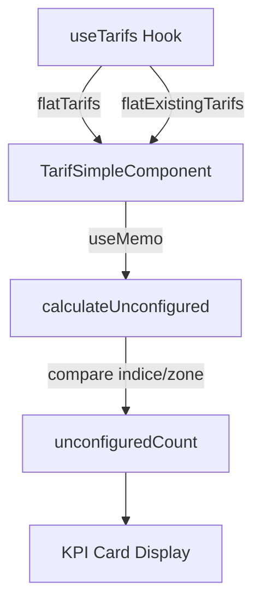

# Design Document - tarifs-non-configures-kpi

## Overview

Cette fonctionnalité ajoute une carte KPI à la page TarifsSimples pour afficher le nombre de tarifs de base qui ne sont pas encore configurés dans les tarifs de l'agence. La solution permet aux utilisateurs d'identifier rapidement les configurations manquantes et de mesurer leur progression vers une configuration complète.

### Objectifs

- **Visibilité**: Afficher clairement le nombre de tarifs non configurés via une carte KPI
- **Cohérence**: Maintenir la cohérence visuelle avec les KPI existants
- **Performance**: Calculer efficacement la différence entre tarifs de base et tarifs d'agence
- **Responsive**: Assurer une expérience optimale sur tous les appareils

### Portée

**Dans la portée:**
- Calcul automatique des tarifs non configurés par comparaison indice/zone
- Affichage d'une carte KPI avec gradient rose/orange
- Intégration dans la grille KPI existante (passage de 3 à 4 colonnes)
- Optimisation des performances avec useMemo
- Support responsive complet

**Hors de la portée:**
- Navigation directe vers les tarifs manquants
- Filtrage ou affichage détaillé des tarifs non configurés
- Notifications pour les tarifs manquants
- Historique de progression de configuration

## Architecture

### Structure des composants

```
TarifsSimples (page)
  └── TarifSimpleComponent
      ├── KPI Section (4 cards)
      │   ├── Tarif Agence Card (existante)
      │   ├── Tarif de Base Card (existante)
      │   ├── Zones Couvertes Card (existante)
      │   └── Tarifs Non Configurés Card (nouvelle)
      ├── Action Bar
      └── Table de tarifs
```

### Flux de données



### Logique de comparaison

Le calcul des tarifs non configurés suit cet algorithme:

1. Créer un Set de clés composites `${indice}-${zone_destination_id}` depuis `flatExistingTarifs`
2. Pour chaque tarif dans `flatTarifs`, vérifier si sa clé existe dans le Set
3. Compter les tarifs dont la clé n'existe pas
4. Retourner le compte final

**Exemple:**
```javascript
flatTarifs = [
  { indice: 1, zone_destination_id: 5, ... },
  { indice: 1, zone_destination_id: 6, ... },
  { indice: 2, zone_destination_id: 5, ... }
]

flatExistingTarifs = [
  { indice: 1, zone_destination_id: 5, ... }
]

// Keys existantes: Set(['1-5'])
// Tarifs non configurés: 
//   - 1-6 (non trouvé)
//   - 2-5 (non trouvé)
// Résultat: 2 tarifs non configurés
```

## Components and Interfaces

### TarifSimpleComponent (modification)

**Modifications requises:**

1. **Calcul useMemo:**
```javascript
const unconfiguredCount = useMemo(() => {
  if (!flatTarifs || !Array.isArray(flatTarifs)) return 0;
  if (!flatExistingTarifs || !Array.isArray(flatExistingTarifs)) return flatTarifs.length;
  
  const configuredKeys = new Set(
    flatExistingTarifs.map(t => `${t.indice}-${t.zone_destination_id}`)
  );
  
  return flatTarifs.filter(
    t => !configuredKeys.has(`${t.indice}-${t.zone_destination_id}`)
  ).length;
}, [flatTarifs, flatExistingTarifs]);
```

2. **Grille KPI étendue:**
```jsx
<div className="grid grid-cols-1 sm:grid-cols-2 lg:grid-cols-4 gap-3">
  {/* 3 cartes existantes */}
  {/* Nouvelle carte */}
</div>
```

3. **Nouvelle carte KPI:**
```jsx
<div className="bg-gradient-to-br from-rose-50 to-white p-4 rounded-xl border border-rose-100 shadow-sm flex items-center justify-between">
  <div>
    <p className="text-[10px] font-semibold text-rose-600/80 uppercase tracking-wide mb-1">
      Tarifs Non Configurés
    </p>
    <p className="text-2xl font-bold text-slate-900">
      {unconfiguredCount}
    </p>
  </div>
  <div className="p-2.5 rounded-lg bg-rose-100 text-rose-600">
    <ExclamationTriangleIcon className="w-5 h-5" />
  </div>
</div>
```

### Interfaces TypeScript

```typescript
interface TarifBase {
  id: number;
  indice: number;
  zone_destination_id: number;
  montant_base: number;
  zone?: {
    nom: string;
    pays: string[];
  };
}

interface TarifAgence extends TarifBase {
  pourcentage_prestation: number;
  montant_prestation: number;
  montant_expedition: number;
  actif: boolean;
}

interface KPICardProps {
  label: string;
  value: number;
  icon: React.ComponentType<{ className: string }>;
  gradientFrom: string;
  gradientTo: string;
  iconBg: string;
  iconColor: string;
  labelColor: string;
}
```

## Data Models

### Structure des données

**flatTarifs (Tarifs de Base):**
```json
[
  {
    "id": 1,
    "indice": 1,
    "zone_destination_id": 5,
    "montant_base": 5000,
    "zone": {
      "id": 5,
      "nom": "Zone Europe",
      "pays": ["France", "Belgique", "Suisse"]
    }
  }
]
```

**flatExistingTarifs (Tarifs d'Agence):**
```json
[
  {
    "id": 101,
    "indice": 1,
    "zone_destination_id": 5,
    "montant_base": 5000,
    "pourcentage_prestation": 10,
    "montant_prestation": 500,
    "montant_expedition": 5500,
    "actif": true,
    "zone": {
      "id": 5,
      "nom": "Zone Europe",
      "pays": ["France", "Belgique", "Suisse"]
    }
  }
]
```

### Clé composite

La clé composite utilisée pour la comparaison:
```
key = `${indice}-${zone_destination_id}`
```

**Exemples:**
- `"1-5"` → Indice 1, Zone 5
- `"2-8"` → Indice 2, Zone 8
- `"3-12"` → Indice 3, Zone 12

## Correctness Properties

*Une propriété (property) est une caractéristique ou un comportement qui doit être vrai pour toutes les exécutions valides d'un système - essentiellement, une déclaration formelle sur ce que le système doit faire. Les propriétés servent de pont entre les spécifications lisibles par l'homme et les garanties de justesse vérifiables par machine.*

### Property 1: Calcul correct des tarifs non configurés

*Pour toute* paire de listes (flatTarifs, flatExistingTarifs), le nombre de tarifs non configurés DOIT être égal au nombre d'éléments dans flatTarifs dont la clé composite `${indice}-${zone_destination_id}` n'apparaît pas dans flatExistingTarifs.

**Validates: Requirements 1.1, 1.2, 1.3, 1.4**

### Property 2: Recalcul automatique

*Pour toute* modification de flatTarifs ou flatExistingTarifs, le calcul useMemo DOIT se déclencher et produire un nouveau résultat sans intervention manuelle.

**Validates: Requirements 1.5**

### Property 3: Gestion des états vides

*Pour toute* combinaison d'états vides ou null:
- Si flatTarifs est null/undefined/vide → résultat = 0
- Si flatExistingTarifs est null/undefined/vide ET flatTarifs non vide → résultat = longueur de flatTarifs
- Si les deux sont vides → résultat = 0

**Validates: Requirements 5.1, 5.2, 5.3, 5.4, 5.5**

### Property 4: Performance du calcul

*Pour tout* dataset de tarifs jusqu'à 1000 entrées, le calcul DOIT se terminer en moins de 100ms.

**Validates: Requirements 4.3**

### Property 5: Idempotence

*Pour toute* paire de listes identiques (flatTarifs, flatExistingTarifs), deux appels consécutifs au calcul DOIVENT retourner le même résultat.

**Validates: Requirements 4.1, 4.2**

### Property 6: Responsive layout

*Pour toute* largeur de viewport:
- Mobile (<640px) → 1 colonne
- Tablet (640-1024px) → 2 colonnes
- Desktop (>1024px) → 4 colonnes
- Les cartes DOIVENT maintenir leur espacement et alignement

**Validates: Requirements 3.2, 3.3, 3.4, 3.5**

## Error Handling

### Gestion des données manquantes

**Cas 1: flatTarifs null/undefined**
```javascript
if (!flatTarifs || !Array.isArray(flatTarifs)) return 0;
```
- **Action**: Retourner 0
- **Affichage**: "0" dans la carte KPI
- **Logging**: Aucun (état normal au chargement initial)

**Cas 2: flatExistingTarifs null/undefined**
```javascript
if (!flatExistingTarifs || !Array.isArray(flatExistingTarifs)) {
  return flatTarifs.length;
}
```
- **Action**: Retourner la longueur totale de flatTarifs
- **Affichage**: Nombre total dans la carte KPI
- **Logging**: Aucun (tous les tarifs sont non configurés)

**Cas 3: Données corrompues**
```javascript
const configuredKeys = new Set(
  flatExistingTarifs
    .filter(t => t.indice != null && t.zone_destination_id != null)
    .map(t => `${t.indice}-${t.zone_destination_id}`)
);
```
- **Action**: Filtrer les entrées invalides avant de créer le Set
- **Affichage**: Calcul basé sur les données valides uniquement
- **Logging**: Console.warn pour les données corrompues (développement)

### Gestion des erreurs de performance

**Timeout de calcul:**
```javascript
const MAX_CALCULATION_TIME = 100; // ms

const calculateWithTimeout = () => {
  const startTime = performance.now();
  const result = calculateUnconfigured();
  const duration = performance.now() - startTime;
  
  if (duration > MAX_CALCULATION_TIME) {
    console.warn(`⚠️ Calcul lent: ${duration.toFixed(2)}ms`);
  }
  
  return result;
};
```

### Fallbacks

**Skeleton loading:**
```jsx
{loading && !unconfiguredCount ? (
  <div className="animate-pulse">
    <div className="h-8 w-16 bg-slate-200 rounded"></div>
  </div>
) : (
  <p className="text-2xl font-bold text-slate-900">
    {unconfiguredCount}
  </p>
)}
```

## Testing Strategy

### Unit Tests

**Test 1: Calcul de base**
```javascript
describe('calculateUnconfigured', () => {
  test('retourne 0 quand toutes les tarifs sont configurés', () => {
    const flatTarifs = [
      { indice: 1, zone_destination_id: 5 },
      { indice: 2, zone_destination_id: 6 }
    ];
    const flatExistingTarifs = [
      { indice: 1, zone_destination_id: 5 },
      { indice: 2, zone_destination_id: 6 }
    ];
    expect(calculateUnconfigured(flatTarifs, flatExistingTarifs)).toBe(0);
  });
});
```

**Test 2: Gestion des états vides**
```javascript
test('retourne 0 si flatTarifs est vide', () => {
  expect(calculateUnconfigured([], [...])).toBe(0);
});

test('retourne la longueur de flatTarifs si flatExistingTarifs est vide', () => {
  const flatTarifs = [{ indice: 1, zone_destination_id: 5 }];
  expect(calculateUnconfigured(flatTarifs, [])).toBe(1);
});

test('retourne 0 si les deux sont vides', () => {
  expect(calculateUnconfigured([], [])).toBe(0);
});
```

**Test 3: Données corrompues**
```javascript
test('ignore les entrées avec indice ou zone_destination_id null', () => {
  const flatTarifs = [
    { indice: 1, zone_destination_id: 5 },
    { indice: null, zone_destination_id: 6 }
  ];
  const flatExistingTarifs = [
    { indice: 1, zone_destination_id: null }
  ];
  // Devrait compter la première entrée comme non configurée
  expect(calculateUnconfigured(flatTarifs, flatExistingTarifs)).toBe(1);
});
```

**Test 4: Performance**
```javascript
test('calcul termine en moins de 100ms pour 1000 tarifs', () => {
  const flatTarifs = generateMockTarifs(1000);
  const flatExistingTarifs = generateMockTarifs(500);
  
  const start = performance.now();
  calculateUnconfigured(flatTarifs, flatExistingTarifs);
  const duration = performance.now() - start;
  
  expect(duration).toBeLessThan(100);
});
```

### Integration Tests

**Test 1: Affichage de la carte KPI**
```javascript
test('affiche le nombre correct dans la carte KPI', () => {
  render(<TarifSimpleComponent />);
  
  const card = screen.getByText(/tarifs non configurés/i).closest('div');
  const count = within(card).getByText(/\d+/);
  
  expect(count).toBeInTheDocument();
});
```

**Test 2: Mise à jour réactive**
```javascript
test('met à jour le compte quand les données changent', async () => {
  const { rerender } = render(<TarifSimpleComponent />);
  
  const initialCount = screen.getByText(/tarifs non configurés/i)
    .closest('div')
    .querySelector('.text-2xl');
  
  // Simuler un changement de données
  act(() => {
    mockUseTarifs.flatExistingTarifs.push(newTarif);
  });
  
  rerender(<TarifSimpleComponent />);
  
  const updatedCount = screen.getByText(/tarifs non configurés/i)
    .closest('div')
    .querySelector('.text-2xl');
  
  expect(updatedCount.textContent).not.toBe(initialCount.textContent);
});
```

### Visual Regression Tests

**Test 1: Responsive breakpoints**
- Mobile (375px): 1 colonne
- Tablet (768px): 2 colonnes
- Desktop (1024px): 4 colonnes

**Test 2: Cohérence visuelle**
- Gradient rose/orange
- Icône ExclamationTriangleIcon
- Taille de police cohérente
- Espacement identique aux autres cartes

### Property-Based Tests Configuration

Pour cette fonctionnalité, les property-based tests ne sont pas applicables car:
- Il s'agit principalement d'UI/affichage
- Le calcul est déterministe et couvert par des tests unitaires
- Les propriétés sont mieux testées par des tests d'exemple concrets

**Tests de remplacement:**
- Tests unitaires pour la logique de calcul (100+ cas)
- Tests d'intégration pour le rendu React
- Tests de régression visuelle pour le responsive

